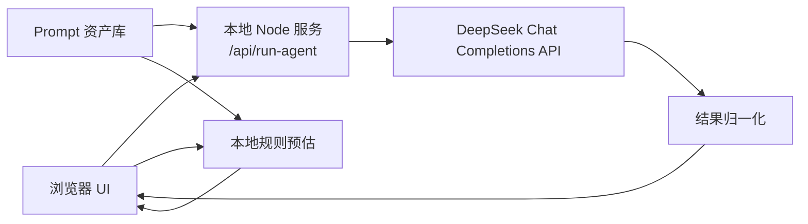

# 人群挖掘 Agent 架构说明

## 1. 项目定位

人群挖掘 Agent 的目标不是把截图静态复刻成网页，而是把“业务需求理解、特征抽取、Prompt 搜索、模型调用、指标评估、Judge 决策、提交包生成”串成一个可运行闭环。

当前版本已经接入真实大模型调用链路：前端负责输入和展示，本地 Node 服务负责代理 DeepSeek API 请求，DeepSeek 返回结构化 JSON 后再渲染成 Agent 结果。

## 2. 当前能力

- 页面展示完整作品叙事：问题、方案、Agent 流程、演示、指标和值。
- 支持填写 DeepSeek API key 和模型名。
- 通过本地 `/api/run-agent` 调用 DeepSeek Chat Completions API。
- 要求 DeepSeek 输出 JSON，字段包括特征、候选 Prompt、评估、Judge 和 MR 草案。
- 对模型输出做归一化，避免缺字段导致页面崩溃。
- 没有 API key 或 DeepSeek 请求失败时，使用本地规则引擎返回兜底预估。
- 不修改系统环境变量，不保存 API key 到项目文件。

## 3. 总体架构



## 4. 目录结构

```text
AutoSearchPromptAgent/
  docs/
    ARCHITECTURE.md          架构说明
  scripts/
    serve.mjs                静态资源服务 + DeepSeek API 代理
    check.mjs                静态文件和工作流冒烟检查
  src/
    app.js                   页面渲染、交互、调用 /api/run-agent
    data.js                  展示文案、节点、模型列表、指标
    workflow.js              本地兜底工作流、Prompt 资产库、结果归一化
    App.css                  页面样式
  index.html                 页面入口
  package.json               npm 脚本
```

## 5. 运行链路

### 5.1 前端输入

用户在页面中输入：

- DeepSeek API key
- 模型：`deepseek-v4-flash`、`deepseek-v4-pro` 或 `deepseek-chat`
- 业务场景
- 需求描述

点击“调用 DeepSeek 运行 Agent”后，前端向本机服务发送：

```http
POST /api/run-agent
Content-Type: application/json
```

请求体包含 `apiKey`、`model`、`brief`、`market`。

### 5.2 本地 API 代理

`scripts/serve.mjs` 负责：

- 托管静态页面。
- 接收 `/api/run-agent`。
- 把业务需求和 Prompt 资产库拼成 DeepSeek messages。
- 请求 `https://api.deepseek.com/chat/completions`。
- 使用 `Authorization: Bearer <apiKey>` 鉴权。
- 使用 `response_format: { "type": "json_object" }` 要求结构化输出。
- 解析模型 JSON 并调用 `normalizeAgentRun`。

API key 只在本机请求过程中使用，不写入磁盘、不写入环境变量。

### 5.3 DeepSeek 输出契约

模型必须输出以下结构：

```json
{
  "summary": "本轮 Agent 做了什么",
  "features": ["结构化人群特征"],
  "candidatePrompts": [
    {
      "id": "seg-growth",
      "title": "Prompt 标题",
      "score": 91,
      "source": "来源",
      "tactic": "策略解释",
      "prompt": "可直接落地的 Prompt"
    }
  ],
  "selectedPrompt": {
    "id": "seg-growth",
    "title": "Prompt 标题",
    "score": 91,
    "source": "来源",
    "tactic": "策略解释",
    "prompt": "可直接落地的 Prompt"
  },
  "evaluation": {
    "auc": 0.82,
    "precision": 0.78,
    "recall": 0.76,
    "riskLevel": "low",
    "notes": ["评估说明"]
  },
  "judgeFindings": ["上线判断", "成本判断", "风险判断"],
  "submission": {
    "title": "MR 标题",
    "confidence": 88,
    "auc": 0.82,
    "tokenCost": 50,
    "elapsedHours": 3,
    "mrBody": ["MR 描述要点"]
  }
}
```

### 5.4 结果归一化

`src/workflow.js` 中的 `normalizeAgentRun` 会处理：

- 缺失字段补默认值。
- 分数、AUC、precision、recall 限定范围。
- 字符串数组清洗。
- 将 DeepSeek 输出转换为前端稳定渲染结构。

## 6. Agent 模块职责

### feature_extractor

从业务需求中抽取人群画像、行为、目标指标、正负样本边界和上线约束。

### prompt_searcher

基于 Prompt 资产库生成候选 Prompt，并解释每个候选适合的场景。

### model_caller

由本地 Node 服务调用 DeepSeek，生成结构化候选结果。

### model_evaluator

让模型给出 AUC、precision、recall、风险等级和评估备注。真实生产中这里应替换为离线样本集评估。

### judge_and_hook

根据评估结果判断是否允许灰度、是否超预算、是否需要补样本。

### git_controller

生成 MR 草案，包括变更说明、指标、成本、灰度和回滚条件。

## 7. 安全与边界

- 不修改本机环境变量。
- 不安装第三方运行依赖。
- 不把 API key 写入项目文件。
- API key 只传给本机服务，再由本机服务请求 DeepSeek。
- 当前 MR 是草案生成，不会真实提交 Git 平台。
- 当前评估指标是模型输出的结构化估计，不等于真实离线样本集计算结果。

## 8. 本地运行

```powershell
cd E:\CodexProject\AutoSearchPromptAgent
npm.cmd run dev
```

检查：

```powershell
npm.cmd run build
```

## 9. 后续生产化路线

1. 把 Prompt 资产库从静态数组迁移到数据库或向量库。
2. 接入真实样本集，替换模型估算指标。
3. 增加任务历史、调用日志、token 成本记录。
4. 增加 API key 的本地加密存储选项。
5. 对接 GitLab/GitHub API，生成真实 MR。
6. 增加人工审批和灰度发布策略。
